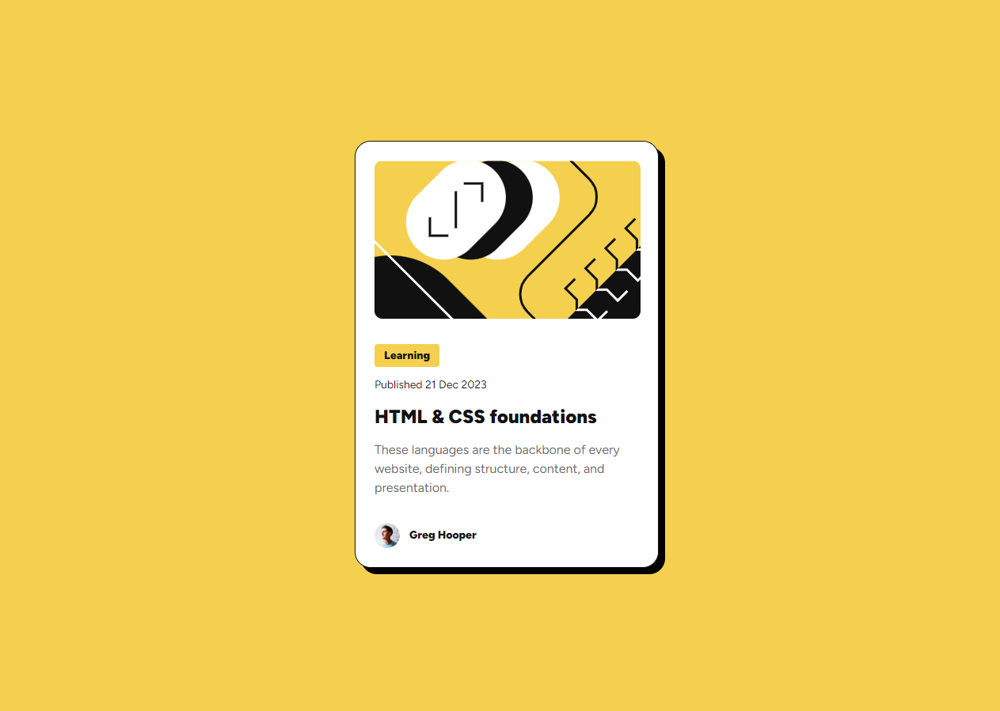

# Blog Preview Card

This is my solution to the [Blog Preview Card challenge on Frontend Mentor](https://www.frontendmentor.io/challenges/blog-preview-card-ckPaj01IcS). Frontend Mentor challenges help you improve your coding skills by building realistic projects.

## Table of contents

- [Overview](#overview)
  - [The challenge](#the-challenge)
  - [Screenshot](#screenshot)
  - [Links](#links)
- [My process](#my-process)
  - [Built with](#built-with)
  - [What I learned](#what-i-learned)
- [Author](#author)

## Overview

### The challenge

This challenge was to build out a simple but stylish blog preview card.

Users should be able to:

- See hover states for all interactive elements on the page

### Screenshot

### Links

- Solution URL: [GitHub repo](https://github.com/ashea29/blog-preview-card-solution/tree/main)
- Live Site URL: [https://tip-calculator-solution-ajs.netlify.app/](https://tip-calculator-solution-ajs.netlify.app/)

## My process

### Built with

- Vite (Vanilla JS)
- Semantic HTML5 markup
- CSS custom properties
- Flexbox
- CSS Grid
- Sass mixins

### What I learned
In this challenge, I was able to get some more practice (always a good thing!) writing semantic HTML, as well as using the BEM naming convention for CSS classes.

Additionally, I was able to solidify a strategy I intend to use, going forward, for creating a maintainable light-theme/dark-theme toggle.

## Author

- Website - [Andrew J Shea | Portfolio](andrewjshea.com)
- Frontend Mentor - [@ashea29](https://www.frontendmentor.io/profile/ashea29)
- GitHub - [ashea29](https://github.com/ashea29)
- LinkedIn - [Andrew J Shea](https://www.linkedin.com/in/andrew-j-shea/)
